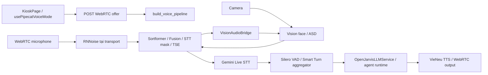

# Onboarding: OpenJarvis kiosk STT

Ngày khảo sát: 2026-10-07. Phạm vi: tiếp nhận handoff STT, đối chiếu source và báo cáo; chưa chạy lại kiểm thử hoặc kiểm tra runtime.

## Tổng quan và stack

OpenJarvis là backend trợ lý AI dạng module; checkout này chạy kiosk đặt hàng bằng giọng nói. Workspace gồm hai Git repo riêng: OpenJarvis xử lý UI, hội thoại và audio; Vision cung cấp presence, face và active-speaker evidence.

| Lớp | Công nghệ / ràng buộc từ manifest |
|---|---|
| Backend | Python >=3.10,<3.14; FastAPI, Pydantic 2, asyncio, uv |
| Voice | Python >=3.11; Pipecat 1.8.1, Gemini Live STT, VieNeu 3.2.3 |
| Speaker | NeMo Sortformer, TitaNet, Fusion/ASD, RNNoise, TSE |
| Frontend | React 19, TypeScript ~5.7, Vite 6, Zustand 5; Node >=20 |
| Native | Rust/PyO3, maturin; Tauri desktop shell |
| Kiểm thử / CI | pytest + pytest-asyncio/xdist, Vitest; Ruff; GitHub Actions |

Phiên bản ở đây là ràng buộc dependency, không phải inventory package đang chạy. Hội thoại voice đi qua session service và store tùy cấu hình; khảo sát này chưa xác định database thực tế của stack.

## Kiến trúc và vòng đời

1. UI gửi offer đến `/api/voice/webrtc/offer`; Pydantic kiểm tra shape request. Route quản lý voice lease, kết nối và khởi tạo pipeline.
2. RNNoise là input filter của transport khi được bật và khả dụng. `SpeakerAudioProcessor` phối hợp diarizer, evidence từ Vision và Fusion; audio gửi sang ASD trước STT masking. TSE cần enrollment đủ điều kiện và xử lý đoạn overlap.
3. Gemini nhận `SttAudioFrame` đã qua gate khi masked feed bật. Capture và Target audio monitor quan sát nhánh này; nghe được audio cục bộ chưa chứng minh kết nối Gemini thành công.
4. Silero VAD ở user aggregator gửi stop upstream tới STT. Source hiện đặt VAD stop 0,2 s, finalize hold 0,6 s; Smart Turn yêu cầu im lặng tối thiểu 1,5 s và fallback 3 s. Đây là tham số source, không phải đề xuất đổi ngưỡng.
5. Transcript đi vào context rồi agent; reply qua lifecycle và VieNeu. Route lưu final turns vào chat/session store khi teardown; lỗi persistence được log và không chặn hội thoại trong RAM.

## Bản đồ file và điểm vào

Các đường dẫn dưới đây tương đối với OpenJarvis, trừ `../vision/`.

| Muốn tìm / sửa | Điểm vào |
|---|---|
| Khởi tạo backend | `src/openjarvis/cli/serve.py`, `system/builder.py`, `server/app.py` trong package |
| UI và voice client | `frontend/src/pages/KioskPage.tsx`, `frontend/src/hooks/usePipecatVoiceMode.ts` |
| Offer, model loading, teardown | `src/openjarvis/server/voice/routes.py` |
| Nối pipeline, VAD/turn timing | `src/openjarvis/server/voice/pipeline.py`, `turn_detection.py` cùng thư mục |
| Gemini profile, masked feed, finalize | `src/openjarvis/server/voice/transcription.py`; preset `[voice.stt]` |
| Mask, diarization, TSE, enrollment | `src/openjarvis/server/voice/speaker_audio.py` |
| Lock và speaker identity | `src/openjarvis/server/voice/speaker_identity.py`, `speaker.py` cùng thư mục |
| ASD stream / face buffer | `src/openjarvis/server/voice/speaker_vision.py`; `../vision/application/active_speaker.py` |
| Telemetry và phát Target audio | `src/openjarvis/server/voice/speaker_console.py`, `target_audio_monitor.py` cùng thư mục |
| Capture WAV/transcript/verdict | `src/openjarvis/server/voice/stt_capture.py` |
| Agent, công cụ, persistence | `src/openjarvis/agents/`, `tools/`, `sessions/`, `server/voice/persistence.py` |
| Replay và benchmark | `scripts/voice_asd_gate_replay.py`, `voice_speaker_replay.py`, `voice_enhancement_replay.py`, `benchmark_target_audio_monitor.py` cùng thư mục |
| Regression tương ứng | `tests/server/test_voice_stt.py`, `test_speaker_audio.py`, `test_speaker_identity.py`, `test_target_audio_monitor.py`, `test_stt_capture.py` cùng thư mục |

## Quy ước và lệnh thường dùng

- Dùng CodeGraph trước tìm/đọc code trong repo có index. Python: snake_case, PascalCase cho class; async I/O và collaborator injection. Frontend dùng React hooks và Zustand.
- Tests Python `test_*.py` theo package; frontend `*.test.ts(x)`. CI ở `.github/workflows/ci.yml`; commit gần đây dùng `feat(scope):`/`fix(scope):` xen lẫn commit tự do. Chưa xác định merge policy.
- Backend, từ OpenJarvis: `uv run ruff check src/ tests/`; `uv run pytest tests/server/test_voice_stt.py tests/server/test_speaker_audio.py tests/server/test_target_audio_monitor.py -q` với voice dependencies đã cài.
- Full backend CI: `uv run pytest tests/ -n auto -q --tb=short -m "not live and not cloud and not hub"`. Handoff có failures/missing dependency lịch sử; không coi toàn suite đang xanh.
- Frontend, từ `frontend/`: `npm run dev`, `npm test`, `npm run build`.
- Vision, từ `../vision/`: `python -m pytest tests/` trong môi trường Vision. Chạy suite hai repo riêng vì cả hai có package `tests`.
- Stack: `scripts/launcher.sh status`; chỉ start/restart khi được yêu cầu. Khảo sát này chưa gọi launcher.

## Trạng thái tiếp nhận và giới hạn bằng chứng

- HEAD OpenJarvis được đọc là `7ddb4053`, branch `feat/live-voice-mode`. Theo handoff, commit sửa Target audio đã push; chưa truy vấn remote lại.
- [Báo cáo Target audio](2026-10-07-target-audio/report.md): queue 200 ms gây drop burst; source hiện giới hạn 8 s / 512 packet và tính thời điểm phát theo audio đang chờ. Synthetic hardware trước sửa drop 40/240; sau sửa 0/240 và 0/200. Counter này chỉ đo monitor playback.
- [Phiên sau khôi phục credit](2026-10-07-overlap-after-credit/report.md): 89,17 s, 14 transcript, lock track 140, TSE ready sau 19,80 s, 6,48 s marked separated, playback drop 0. Gemini send/transcript đã được ghi nhận trong phiên đó.
- WER 5,80% là phép so sánh tạm tính trên 138 từ; ba lần lặp suy ra từ transcript, không có xác nhận operator về số lượt/mốc video. Không dùng để kết luận hiệu quả lọc video. Giảm dBFS chưa xác định giọng nào bị loại.
- [ASD diagnostic](2026-10-07-asd-diagnostic/report.md): hai lượt solo thành công; replay lệch timestamp khoảng 220 ms mới là giả thuyết. [Lượt 20 câu](2026-10-07-stt-live-1502/report.md) không lock/TSE-ready nên không tương đương phiên sau.
- Báo cáo Target audio ghi chưa restart tại thời điểm viết; handoff sau đó ghi stack đã restart và idle. Trạng thái hiện tại cần quan sát mới nếu người dùng yêu cầu.

## Bước tiếp theo khi được yêu cầu kiểm chứng

Một lượt đọc cố định, mỗi câu đúng một lần; lưu ground truth và marker solo/video ngay trong phiên. Chỉ bắt đầu overlap sau khi xác nhận Gemini hoạt động, `LOCKED` và `tse_ready`; đối chiếu raw/heard, send/transcript, verdict và separated intervals. Tiến hành từng giả thuyết và phép thử nhỏ; giữ TSE theo lựa chọn người dùng cho tới khi có A/B chứng minh nguyên nhân.

Capture giọng/face crop giữ trên máy, không upload; không in secrets. Preserve thay đổi ngoài phạm vi: Vision đang có sửa presence/state/scene/main và tests; OpenJarvis có `.agents/` và các diagnostic chưa commit. Không stage/commit báo cáo nếu chưa được yêu cầu.
